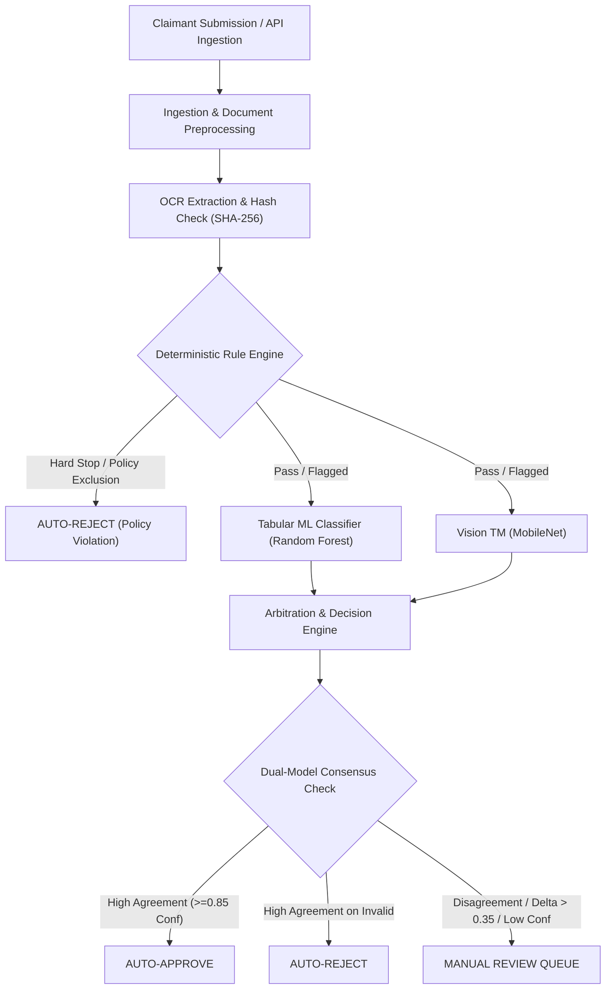

# AssureX Claim Engine

[](https://www.python.org/)
[](https://fastapi.tiangolo.com/)
[](https://scikit-learn.org/)
[](https://teachablemachine.withgoogle.com/)
[](https://www.sqlite.org/)
[](LICENSE)

> **Disclaimer: Academic project developed for TechWizz 2026 NextWave AI Competition**

**AssureX Claim Engine** is a dual-AI automated warranty claim adjudication platform. It combines deterministic business rule engines, supervised tabular machine learning, and computer vision (Teachable Machine) summary card verification to deliver real-time AI adjudication.

---

## Table of Contents
1. [System Overview & Architecture](#system-overview--architecture)
2. [Key Capabilities](#key-capabilities)
3. [Dual-AI Arbitration Matrix](#dual-ai-arbitration-matrix)
4. [Installation & Setup](#installation--setup)
5. [Execution Guide](#execution-guide)
6. [REST API Documentation](#rest-api-documentation)

---

## System Overview & Architecture

AssureX addresses the warranty claim management problem by automating claim validation. Claims flow through a multi-stage validation pipeline:



---

## Key Capabilities

- **Real-time AI adjudication:** Fast evaluation, feature extraction, and dual-model inference.
- **Anti-Fraud Checks:**
  - SHA-256 cryptographic document deduplication.
  - OCR serial number matching against records.
  - Temporal contradiction detection (claim date preceding purchase date).
  - Policy exclusion detection (liquid contact, accidental drop).
- **Dual-AI Verification:**
  - **Tabular ML Model:** Random Forest trained on 23 engineered features.
  - **Vision Teachable Machine:** MobileNetV2 classifying synthesized claim cards.
- **Grace Period Engine:** Configurable 15-day grace period with automatic routing to human review.

---

## Dual-AI Arbitration Matrix

| Rule Engine | Tabular ML Prediction | Vision TM Prediction | Final Decision | Action |
|---|---|---|---|---|
| **FAIL** | *Any* | *Any* | **`AUTO_REJECT`** | Immediate rejection |
| **PASS** | `Valid Claim` ($\ge 0.85$) | `Valid Claim` ($\ge 0.80$) | **`AUTO_APPROVE`** | Instant approval |
| **PASS** | `Invalid Claim` ($\ge 0.85$) | `Invalid Claim` ($\ge 0.80$) | **`AUTO_REJECT`** | Rejection |
| **FLAGGED** | *Any* | *Any* | **`MANUAL_REVIEW`** | Dispatched to human adjuster |
| **PASS** | `Valid Claim` | `Manual Review` / `Invalid` | **`MANUAL_REVIEW`** | Model divergence trigger |

---

## Installation & Setup

### Prerequisites
- Python 3.11 or 3.12
- Git

### Step-by-Step Installation

```bash
git clone https://github.com/AssureX-Engine/AssureX-Claim-Engine.git
cd AssureX-Claim-Engine

python -m venv venv

# Windows:
.\venv\Scripts\Activate.ps1
# Mac/Linux:
source venv/bin/activate

pip install -r requirements.txt
```

---

## Execution Guide

### 1. Initialize Database
```bash
python -m src.scripts.init_db
```

### 2. Train Tabular ML Models
```bash
python -m src.ml.train --train data/train/claims_train.csv --val data/validation/claims_validation.csv
```

### 3. Start the FastAPI Server
```bash
uvicorn src.main:app --host 127.0.0.1 --port 8000 --reload
```
API Docs: **`http://127.0.0.1:8000/docs`**  
Web Dashboard: **`http://127.0.0.1:8000/`**

---

## REST API Documentation

### Evaluate Claim Endpoint
- **Endpoint:** `POST /api/v1/claims/evaluate`
- **Request Body Example:**
```json
{
  "claim_id": "CLM-2024-9012",
  "product_id": "PRD-ELE-27927",
  "serial_number": "ELC-SAM-904751",
  "purchase_date": "2024-03-10",
  "claim_submission_date": "2024-08-15"
}
```

---

## License
This project is licensed under the MIT License — see the [LICENSE](LICENSE) file for details.