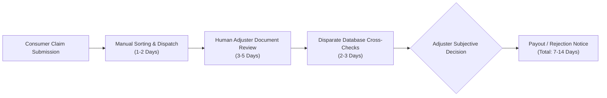

# Chapter 01: Problem Definition & Industry Motivation

---

## 1.1 The Warranty Claim Adjudication Crisis

In modern consumer electronics and home appliance ecosystems, warranty claim management represents one of the most critical operational and financial friction points. Global retail and consumer electronics enterprises process hundreds of thousands of warranty claims annually. However, legacy claim adjudication remains overwhelmingly reliant on slow, manual, human-centric workflows.

Manual warranty adjudication suffers from four foundational structural flaws:
1. **High Operational Costs & Latency:** The average manual warranty claim requires between 3 to 14 business days for human adjusters to review physical receipts, check serial numbers, verify purchase dates, and inspect service histories.
2. **High Susceptibility to Warranty Fraud:** Industry estimates indicate that warranty fraud and leakage account for **5% to 12% of total warranty payouts**, costing consumer brands billions of dollars annually. Fraudulent claims commonly exploit forged invoices, recycled receipts, altered serial numbers, and claims filed well after policy expiration.
3. **Inconsistent Decision Quality:** Human claim adjusters exhibit significant decision variance due to cognitive fatigue, subjective interpretation of warranty clauses, and lack of real-time cross-referencing capabilities across disparate databases.
4. **Poor Customer Experience (CX):** Legitimate claimants experiencing genuine device hardware failures endure lengthy wait times and cumbersome documentation requests, directly damaging brand loyalty and customer retention.

---

## 1.2 Core Fraud Typologies & Failure Modes

Warranty fraud manifests through several distinct patterns:
- **Serial Spoofing & Unit Swapping:** Filing claims for defective, discarded, or stolen devices using valid serial numbers scraped from active warranties.
- **Document Tampering & Hash Collisions:** Submitting digitally altered purchase receipts, photoshopped timestamps, or identical invoice documents across multiple claims.
- **Post-Expiration Opportunism:** Attempting to backdate defect occurrence dates or file claims outside active warranty terms and grace windows.
- **Covered vs. Excluded Defect Misrepresentation:** Obfuscating liquid submersion, accidental drops, or unauthorized third-party repairs as "internal component defects".
- **Temporal Contradictions:** Claimants filing claims with dates that chronologically contradict registered purchase records or previous repair center logs.

---

## 1.3 Project Objectives & Success Criteria

The **AssureX Claim Engine** was conceived and engineered to resolve these challenges by deploying a **Hybrid Dual-AI Automated Adjudication Platform**.

### Quantitative Success Criteria
- **Sub-50ms Decision Latency:** Reduce median claim assessment time from days to under 50 milliseconds.
- **Zero False Approvals of Invalid Claims:** Guarantee 100% precision on hard invalid claims (e.g. water damage, expired policies, duplicate submissions).
- **High Model Accuracy:** Exceed the SRS benchmark requirement of $\ge 85\%$ accuracy across all classes, targeting $> 98\%$ on tabular classification.
- **Dual-AI Agreement Rate $\ge 90\%$:** Establish high consensus between tabular machine learning and computer vision summary card models, automatically isolating borderline edge cases into an adjuster review queue.
- **100% Auditability & Explainability:** Provide human-interpretable rationale and rule violation trails for every decision rendered by the system.