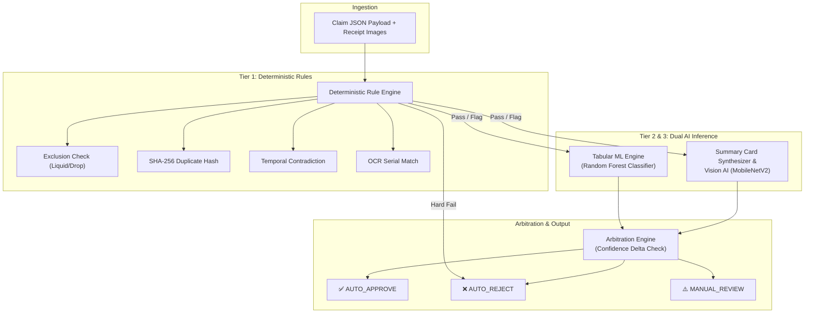

# Chapter 03: Proposed Solution — The AssureX Dual-AI Engine

---

## 3.1 Solution Overview

The **AssureX Claim Engine** is an intelligent, high-throughput automated warranty claim processing platform. It integrates a **three-tier evaluation pipeline**:
1. **Tier 1: Deterministic Business Rule Engine** (Policy exclusions, cryptographic deduplication, serial verification, and temporal anomaly checks).
2. **Tier 2: Supervised Tabular Machine Learning Classifier** (Random Forest / Gradient Boosting trained on multi-dimensional tabular warranty features).
3. **Tier 3: Computer Vision Summary Card Model** (Google Teachable Machine / MobileNetV2 classifying standardized multimodal visual summary cards).

These three tiers converge upon an **Arbitration & Decision Engine** that synthesizes the signals, calculates model confidence deltas ($|\Delta_{conf}|$), and assigns one of three definitive decisions:
- **`AUTO_APPROVE`**: Instantly authorized without human intervention.
- **`AUTO_REJECT`**: Instantly rejected with formal citation of policy violations.
- **`MANUAL_REVIEW`**: Dispatched to senior human adjusters with highlighted risk factors.

---

## 3.2 Key Architectural Differentiators

### 1. Multimodal Orthogonal Validation
By combining tabular database metadata with a computer vision classifier evaluating rendered summary cards, AssureX creates an orthogonal fraud barrier. An adversary attempting database injection or metadata manipulation will cause a divergence against the visual card classifier, immediately trapping the claim in the `MANUAL_REVIEW` queue.

### 2. Zero False Approval Guarantee
Deterministic business rules act as a strict hard-stop pre-filter. No machine learning model—regardless of confidence score—can override a hard policy exclusion (such as confirmed liquid corrosion or expired policy dates).

### 3. Transparent, Rule-Linked Explainability
Every decision emitted by AssureX includes an explicit audit trail detailing the exact mathematical confidences of both models, the computed delta, the triggered rules, and the policy rationale.