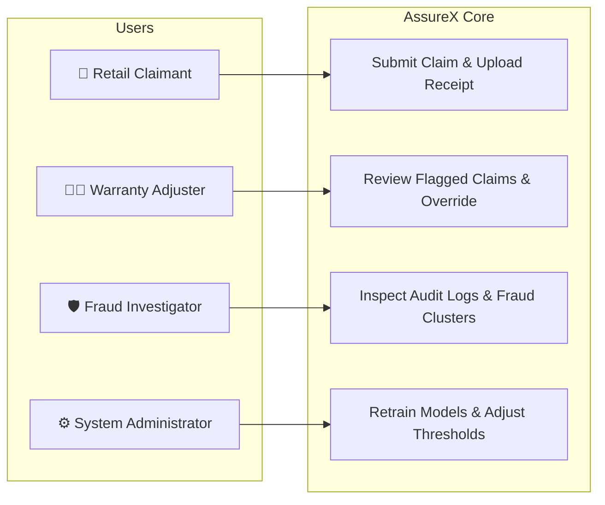

# Chapter 05: Requirements Engineering & SRS Specifications

---

## 5.1 Functional Requirements (FR)

| Requirement ID | Module / Area | Description | Priority |
|---|---|---|---|
| **FR-01** | Claim Ingestion | System shall accept structured claim JSON payloads and multipart receipt image uploads via REST API. | Mandatory |
| **FR-02** | Deterministic Pre-Filtering | System shall execute hard business rules (policy exclusions, warranty expiration, serial matching, duplicate hashing) before AI model inference. | Mandatory |
| **FR-03** | Tabular ML Prediction | System shall generate class predictions and calibrated probability scores ($[0.0, 1.0]$) using the trained Random Forest pipeline. | Mandatory |
| **FR-04** | Vision TM Classification | System shall synthesize a standardized claim summary card and execute MobileNetV2 vision classification to produce an independent prediction and confidence. | Mandatory |
| **FR-05** | Arbitration Logic | System shall compare model predictions, compute $|\Delta_{conf}|$, and route disagreements ($> 0.35$) to `MANUAL_REVIEW`. | Mandatory |
| **FR-06** | Grace Period Adjudication | System shall evaluate claims submitted between 1 and 15 days past policy expiration and flag them for human review. | Mandatory |
| **FR-07** | Deduplication Engine | System shall compute SHA-256 hashes of submitted document images and query the database for duplicate submissions. | Mandatory |
| **FR-08** | Audit & Traceability | System shall record all evaluation steps, intermediate model outputs, triggered rules, and final decisions into an immutable audit table. | Mandatory |
| **FR-09** | Adjuster Web Console | System shall provide a web-based dashboard allowing warranty adjusters to inspect claims, view model cards, review flagged cases, and record final adjudications. | High |
| **FR-10** | Metrics & Reporting | System shall compute and export model comparison metrics, confusion matrices, and analytics in CSV and Markdown formats. | High |

---

## 5.2 Non-Functional Requirements (NFR)

| Requirement ID | Category | Requirement Specification |
|---|---|---|
| **NFR-01** | Accuracy Benchmark | Tabular ML and Vision models must achieve $\ge 85.0\%$ accuracy on the held-out test split. |
| **NFR-02** | Zero False Approvals | Zero claims with hard policy violations (e.g. water damage, hard expiration) shall receive `AUTO_APPROVE`. |
| **NFR-03** | End-to-End Latency | Total claim evaluation pipeline latency must not exceed $100\text{ ms}$ under standard loads. |
| **NFR-04** | Security & Auth | All API administrative endpoints must enforce JWT bearer token authentication and RBAC permissions. |
| **NFR-05** | Modularity & Maintainability| Clear separation of concerns across API, core logic, ML pipelines, ORM models, and services. |

---

## 5.3 User Personas & Use Case Overview

