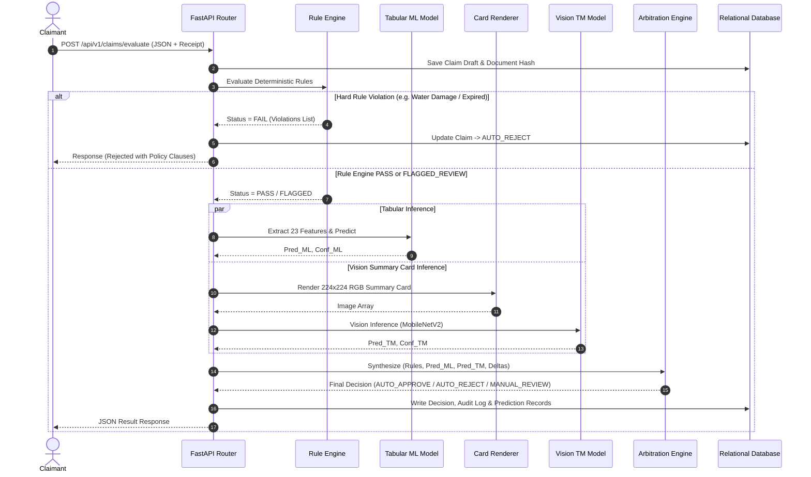

# Chapter 06: System Architecture & Structural Design

---

## 6.1 Architectural Pattern & High-Level Design

The **AssureX Claim Engine** follows a layered, modular microservice-ready architecture built on top of **FastAPI** (asynchronous Python web framework) and **SQLAlchemy ORM**.

```mermaid
graph TD
    subgraph Client Layer
        A1["🌐 React / Tailwind Web UI"]
        A2["📱 Mobile Claim App"]
        A3["🔌 Enterprise ERP / B2B API"]
    end

    subgraph API & Gateway Layer
        B["FastAPI ASGI Gateway\n(CORS / Rate Limiter / JWT Auth / RBAC)"]
    end

    subgraph Core Business Services Layer
        C1["Claim Ingestion Service"]
        C2["Deterministic Rule Engine"]
        C3["OCR Extraction & Hash Service"]
        C4["Arbitration & Decision Service"]
        C5["Audit & Notification Service"]
    end

    subgraph Dual-AI Intelligence Layer
        D1["Tabular ML Predictor\n(Random Forest Classifier)"]
        D2["Summary Card Renderer\n(Pillow Graphics Subsystem)"]
        D3["Vision TM Classifier\n(MobileNetV2 Transfer Model)"]
    end

    subgraph Data & Persistence Layer
        E1[("SQLite / PostgreSQL\nRelational DB")]
        E2["🗄️ File Storage\n(Receipts & Summary Cards)"]
        E3["📦 Model Registry\n(Joblib & TFJS Artifacts)"]
    end

    Client Layer --> B
    B --> Core Business Services Layer
    Core Business Services Layer --> Dual-AI Intelligence Layer
    Core Business Services Layer --> Data & Persistence Layer
    Dual-AI Intelligence Layer --> Data & Persistence Layer
```

---

## 6.2 Data Flow Architecture (Level-1 DFD)

The lifecycle of a claim transaction from upload to final settlement follows a deterministic multi-stage execution flow:



---

## 6.3 Decoupling & Error Fault Tolerance
- **Graceful Vision Fallback:** If the computer vision card rendering encounters a non-critical rendering error, the arbitration subsystem falls back to tabular model predictions with an automatic flag for human adjuster confirmation.
- **Atomic Database Transactions:** All database writes (Claim state, Prediction log, Audit trace) are wrapped in SQLAlchemy atomic sessions, preventing partial data persistence during network or compute interruptions.