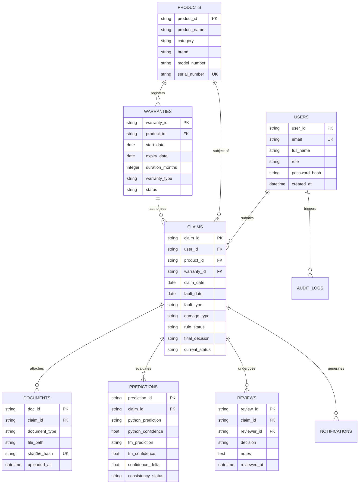

# Chapter 08: Database Design & Entity-Relationship Modeling

---

## 8.1 Entity-Relationship (ER) Architecture

The AssureX Claim Engine employs a 3NF normalized relational schema designed for SQLite / PostgreSQL via SQLAlchemy ORM.

---

## 8.2 Indexing & Performance Optimization

To guarantee sub-5ms database lookups during high-concurrency API evaluation:
1. **Document Deduplication Index:** Unique B-tree index on `documents.sha256_hash` to detect duplicate file uploads in $O(1)$ time.
2. **Serial Number Lookups:** Unique index on `products.serial_number` to cross-reference OCR extractions instantly.
3. **Claim Filter Indexes:** Composite index on `claims(current_status, final_decision, claim_date)` for rapid adjuster dashboard filtering and pagination.