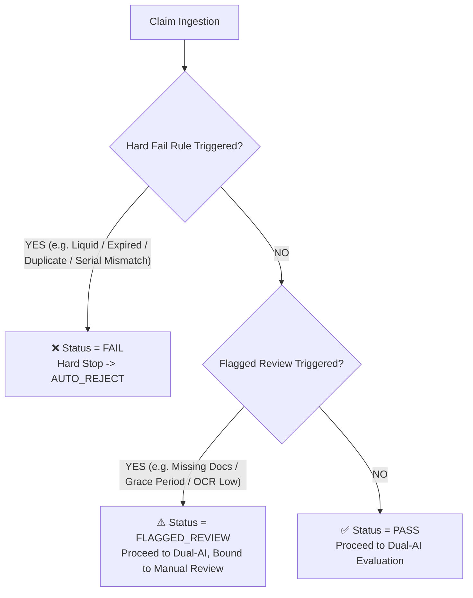

# Chapter 10: Deterministic Rule Engine Design & Specification

---

## 10.1 Philosophy & Precedence Hierarchy

The **AssureX Deterministic Rule Engine** serves as the authoritative, non-negotiable safety gate for claim adjudication. While machine learning models provide probabilistic pattern recognition, the Rule Engine enforces strict legal covenants and contract clauses.

---

## 10.2 Formal Rule Specifications

### Tier 1: Hard Policy Exclusion Rules (Direct Rejection)

1. **`RULE-EXCL-01`: Liquid & Physical Damage Exclusion**
   $$\text{IF } \text{excluded\_damage} = \text{"yes"} \lor \text{damage\_type} \in \{\text{"liquid\_spill\_damage"}, \text{"accidental\_damage"}\} \implies \text{FAIL}$$
   *Clause 4.1:* Consumer warranty explicitly excludes internal corrosion, submersion, and screen shatter from accidental drop.

2. **`RULE-EXCL-02`: Hard Warranty Expiration**
   $$\text{IF } \text{remaining\_warranty\_days} < -15 \lor (\text{warranty\_active} = \text{"no"} \land \text{remaining\_warranty\_days} < 0) \implies \text{FAIL}$$
   *Clause 2.3:* Claims submitted $> 15$ days post-expiration are legally void.

3. **`RULE-EXCL-03`: Cryptographic Duplicate Submission**
   $$\text{IF } \text{is\_duplicate} = \text{"yes"} \lor \text{SHA256}(\text{Receipt}) \in \text{ExistingHashes} \implies \text{FAIL}$$
   *Fraud Shield:* Prevents recycling previously settled or rejected invoices.

4. **`RULE-EXCL-04`: Serial Number Confirmed Mismatch**
   $$\text{IF } \text{serial\_status} = \text{"mismatch"} \lor \text{contradiction\_type} = \text{"serial\_conflict"} \implies \text{FAIL}$$
   *Hardware Integrity:* Physical device serial scanned via OCR contradicts registered warranty record.

5. **`RULE-EXCL-05`: Unauthorized Third-Party Intervention**
   $$\text{IF } \text{repair\_history\_count} > 0 \land \text{repair\_authorized} = \text{"no"} \implies \text{FAIL}$$
   *Clause 4.2:* Uncertified technician disassembly voids OEM warranty seals.

6. **`RULE-EXCL-06`: Chronological Contradiction**
   $$\text{IF } \text{claim\_submission\_date} < \text{purchase\_date} \lor \text{fault\_occurrence\_date} < \text{purchase\_date} \implies \text{FAIL}$$
   *Temporal Integrity:* Device fault or claim cannot predate retail purchase.

---

### Tier 2: Boundary & Discretionary Rules (Flag for Review)

1. **`RULE-FLAG-01`: 15-Day Grace Period Boundary**
   $$\text{IF } -15 \le \text{remaining\_warranty\_days} < 0 \implies \text{FLAGGED\_REVIEW}$$
   Allows human adjusters to approve goodwill coverage if the defect occurred within active warranty.

2. **`RULE-FLAG-02`: Incomplete Mandatory Documents**
   $$\text{IF } \text{mandatory\_docs\_complete} = \text{"no"} \lor \text{missing\_document\_count} > 0 \implies \text{FLAGGED\_REVIEW}$$
   Prompts claimant via email/portal to supply missing receipts or diagnostic sheets.

3. **`RULE-FLAG-03`: Reporting Deadline Boundary**
   $$\text{IF } 24 \le \text{claim\_reporting\_days} \le 30 \implies \text{FLAGGED\_REVIEW}$$
   Flags claims submitted at the edge of the 30-day reporting window for verification of fault date.