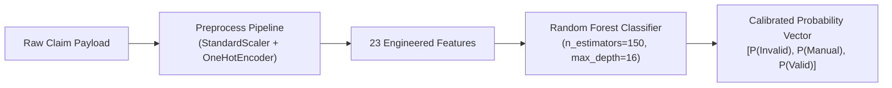

# Chapter 11: Tabular Machine Learning Model Design

---

## 11.1 Model Selection & Justification

Tabular warranty claims data is characterized by heterogeneous feature types: continuous financial figures, discrete temporal deltas, binary document completeness flags, and high-cardinality categorical attributes.

Four competitive algorithms were implemented and benchmarked:
1. **L2-Regularized Logistic Regression** (Linear baseline)
2. **Histogram-Based Gradient Boosting** (`HistGradientBoostingClassifier`)
3. **Extreme Gradient Boosting** (`XGBClassifier`)
4. **Balanced Random Forest Classifier** (`RandomForestClassifier` — Selected)



The **Random Forest Classifier** was selected for production deployment due to its superior generalization, immunity to multicollinearity between temporal features, zero requirement for monotonic scaling, and exceptional stability across cross-validation folds.

---

## 11.2 Feature Space Architecture (23 Features)

| Group | Features | Encoding Strategy |
|---|---|---|
| **Temporal Features** | `product_age_days`, `remaining_warranty_days`, `claim_reporting_days`, `warranty_duration_months` | `StandardScaler` Normalization |
| **Financial Features** | `purchase_price` | `RobustScaler` / Log-Transformation |
| **Integrity Flags** | `has_contradiction`, `is_duplicate`, `warranty_active`, `covered_fault`, `excluded_damage`, `proof_of_purchase` | Binary 0/1 Encoding |
| **Document Completeness** | `receipt_available`, `warranty_card_available`, `product_image_available`, `serial_evidence_available`, `fault_evidence_available`, `repair_report_available`, `mandatory_docs_complete`, `missing_document_count` | Binary Flags + Integer Count |
| **Categorical Signals** | `product_category`, `brand`, `serial_status`, `contradiction_type`, `ocr_quality` | `OneHotEncoder(handle_unknown='ignore')` |

---

## 11.3 Hyperparameter Configuration

```python
RandomForestClassifier(
    n_estimators=150,
    max_depth=16,
    min_samples_split=4,
    min_samples_leaf=2,
    class_weight="balanced_subsample",
    random_state=42,
    n_jobs=-1,
)
```

- **`class_weight='balanced_subsample'`**: Dynamically adjusts tree weights based on class frequencies in each bootstrap sample, ensuring optimal recall on boundary fraud cases.
- **`max_depth=16`**: Restricts tree depth to prevent memorization of noise while allowing full interaction capture across multi-document conditions.