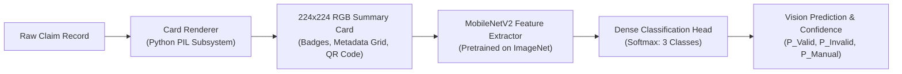

# Chapter 12: Google Teachable Machine Vision Model Design

---

## 12.1 Vision-Based Dual AI Architecture

To prevent single-point-of-failure vulnerabilities inherent in purely tabular databases, the AssureX Claim Engine introduces an orthogonal **Computer Vision Verification Subsystem** powered by Google Teachable Machine (transfer learning over **MobileNetV2**).

Instead of classifying raw, unstructured receipt photos (which vary unpredictably in lighting, fold lines, and angle), AssureX synthesizes a standardized **Claim Summary Card** (224x224 RGB image) for every transaction.



---

## 12.2 Visual Summary Card Encoding Schema

Each rendered card encodes multidimensional claim integrity signals into visual geometry and color spectra:
1. **Header Banner & Validity Badges:** Top-level color bars (Emerald `#10B981` for active valid, Crimson `#EF4444` for exclusions/expired, Amber `#F59E0B` for missing documents or grace boundaries).
2. **Metadata Layout Matrix:** Standardized typography grid displaying Product Name, Category, Serial, Purchase Price, and Warranty Days Remaining. Missing fields render as distinct blank or strikethrough patterns.
3. **Cryptographic Integrity Visuals:** A 2D QR code / Barcode pattern encoding the SHA-256 document hash and digital signature.

---

## 12.3 Model Architecture & Training Protocol

- **Base Backbone:** MobileNetV2 (depth multiplier 1.0, resolution $224 \times 224 \times 3$).
- **Transfer Learning Protocol:** Feature extraction layers frozen; top dense layers trained with Adam optimizer ($\text{lr} = 10^{-4}$, categorical cross-entropy loss).
- **Inference Runtime:** Exported in standard TensorFlow.js (`model.json` + `weights.bin`) and Python TFLite / Keras format for sub-50ms execution.

```
Input (224x224x3) ──► MobileNetV2 Backbone ──► GlobalAvgPool2D ──► Dense(128, ReLU) ──► Dropout(0.3) ──► Dense(3, Softmax)
```

---

## 12.4 Complementary Strengths of Dual Architecture

| Dimension | Tabular Machine Learning Model | Vision Teachable Machine Model |
|---|---|---|
| **Input Domain** | Normalized continuous & categorical tabular vectors | 2D Spatial and visual pattern arrays |
| **Sensitivity** | Highly sensitive to exact arithmetic date bounds | Highly sensitive to macro visual consistency & document completeness |
| **Vulnerability** | Susceptible to schema drift or corrupted columns | Robust against individual column encoding errors |
| **Combined Effect** | **Orthogonal Dual-AI Consensus:** Mutual cross-checking prevents undetected fraud. |