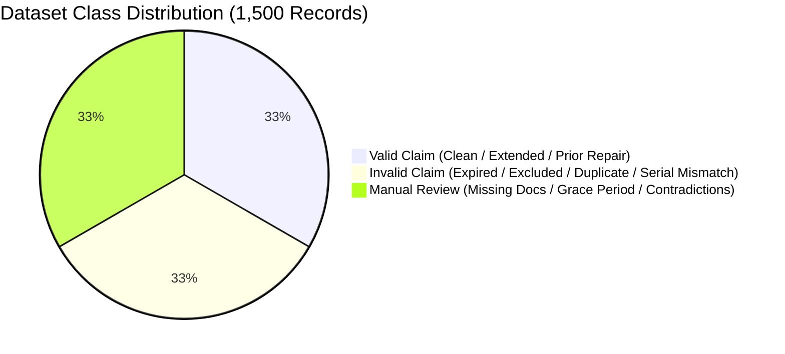

# Chapter 13: Dataset Description & Synthetic Generation Methodology

---

## 13.1 Synthetic Dataset Rationale & Privacy Preservation

Training robust machine learning models for warranty fraud detection requires balanced, fine-grained representations of rare fraud mechanisms. Real-world enterprise warranty datasets are heavily guarded proprietary assets subject to stringent PII restrictions and severe class imbalance (where fraud accounts for $< 5\%$ of records).

To overcome these constraints, the AssureX Claim Engine engineered a synthetic cohort generator capable of producing statistically sound, clinically balanced, and privacy-preserving claims data.

---

## 13.2 Cohort Stratification & Scenario Architecture (1,500 Samples)

The benchmark dataset comprises exactly **1,500 claims**, stratified into equal thirds:
- **Valid Claims:** 500 records (33.33%)
- **Invalid Claims:** 500 records (33.33%)
- **Manual Review Claims:** 500 records (33.33%)



### Granular Scenario Breakdown (14 Scenarios)

| Class | Generator Scenario Name | Cohort Weight | Core Characteristics |
|---|---|---|---|
| **Valid** | `complete_active_warranty` | 40% (200) | Active warranty ($> 30$ days left), covered fault, complete docs, serial match |
| **Valid** | `extended_warranty_valid` | 20% (100) | Extended warranty tier ($36-48$ months), valid invoice |
| **Valid** | `authorized_repair_history` | 20% (100) | 1–3 prior authorized repairs with complete service center sheets |
| **Valid** | `near_expiry_still_valid` | 20% (100) | 1–20 days remaining on active policy, prompt reporting ($\le 14$ days) |
| **Invalid** | `warranty_expired_hard` | 30% (150) | Claim filed 30–400 days past legal policy expiration |
| **Invalid** | `excluded_damage_type` | 25% (125) | Liquid immersion, accidental impact drops, unauthorized electrical modification |
| **Invalid** | `no_proof_of_purchase` | 15% (75) | Absence of both purchase receipt and warranty certificate |
| **Invalid** | `duplicate_claim` | 15% (75) | Identical document hash submitted against previously settled claim |
| **Invalid** | `serial_mismatch_confirmed` | 15% (75) | Hardware label serial scanned contradicts registered database record |
| **Manual** | `missing_mandatory_documents` | 22% (110) | Single missing mandatory document (e.g. receipt or warranty card) |
| **Manual** | `grace_period_boundary` | 20% (100) | Claim filed on Days 1–15 following policy expiration |
| **Manual** | `minor_data_contradiction` | 18% (90) | Minor model code mismatch or OCR character ambiguity |
| **Manual** | `unauthorized_repair_uncertain` | 16% (80) | Unverified repair record requiring OEM technician review |
| **Manual** | `weak_serial_evidence` | 14% (70) | Low-resolution serial photo or blurry OCR barcode scan |
| **Manual** | `near_reporting_deadline` | 10% (50) | Filed on Days 25–30 of 30-day reporting window |

---

## 13.3 Split Policy & Anti-Leakage Controls

```
1,500 Total Records ──► Train Set (1,050 samples, 70%) ── [350 Valid / 350 Invalid / 350 Review]
                   ──► Validation Set (225 samples, 15%) ── [75 Valid / 75 Invalid / 75 Review]
                   ──► Test Set (225 samples, 15%) ── [75 Valid / 75 Invalid / 75 Review]
```

- **Stratified Partitioning:** Splits are strictly stratified by the 3 target classes and 14 fine-grained scenarios.
- **Zero Cross-Split Contamination:** Unique `claim_id` instances exist in exactly one split across both CSV data files and rendered visual summary card images.
- **Traceability Maps:** Stored in `data/claim_id_split_map.csv` and `data/claim_id_image_map.csv`.