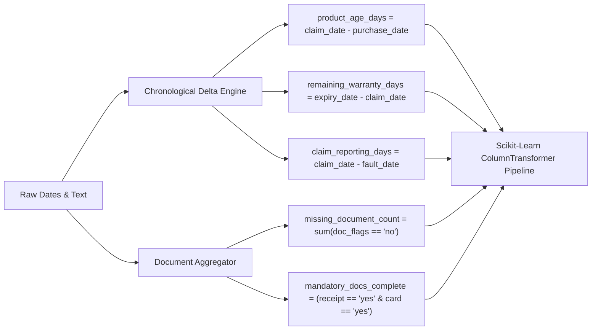

# Chapter 14: Preprocessing & Feature Engineering Pipeline

---

## 14.1 Raw Ingestion & Chronological Feature Extraction

The transformation pipeline converts raw heterogeneous claims into structured numerical vectors through mathematical feature derivation:



---

## 14.2 Preprocessing Subsystem (`src.ml.preprocess_pipeline`)

The production pipeline utilizes `sklearn.compose.ColumnTransformer` with three specialized transformers:

```python
numeric_transformer = Pipeline(
    steps=[
        ("imputer", SimpleImputer(strategy="median")),
        ("scaler", StandardScaler()),
    ]
)

categorical_transformer = Pipeline(
    steps=[
        ("imputer", SimpleImputer(strategy="constant", fill_value="missing")),
        ("onehot", OneHotEncoder(handle_unknown="ignore", sparse_output=False)),
    ]
)

boolean_transformer = Pipeline(
    steps=[
        ("imputer", SimpleImputer(strategy="constant", fill_value=0)),
    ]
)
```

---

## 14.3 Mathematical Transformations & Imputation

1. **Continuous Feature Standardization:**
   $$z = \frac{x - \mu}{\sigma}$$
   Ensures zero-mean unit-variance for `product_age_days`, `remaining_warranty_days`, `claim_reporting_days`, and `purchase_price`.

2. **Boolean Mapping:**
   String flags (`"yes"`, `"no"`, `"true"`, `"false"`) are mapped deterministically to $\{1, 0\}$.

3. **Label Encoding:**
   Target classes are mapped to discrete integer labels:
   $$\text{Invalid Claim} \mapsto 0, \quad \text{Manual Review} \mapsto 1, \quad \text{Valid Claim} \mapsto 2$$
   Serialized via `label_encoder.joblib` for reproducible decoding.