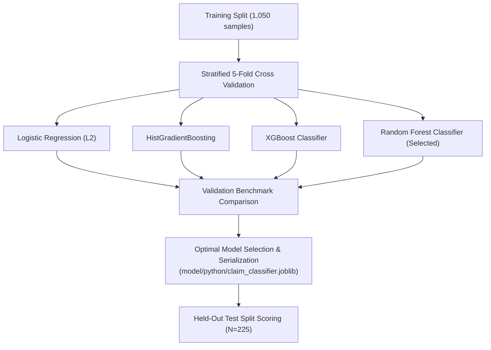

# Chapter 15: Model Training, Hyperparameter Tuning & Benchmark Evaluation

---

## 15.1 Training Protocol & Multi-Algorithm Benchmark

The training protocol utilizes **Stratified 5-Fold Cross-Validation** on the training split (1,050 samples) followed by evaluation on the validation split (225 samples) and final scoring on the held-out test split (225 samples).



---

## 15.2 Benchmark Results Table

| Candidate Algorithm | Train Acc | Val Acc | Val Macro F1 | Test Acc | Test Macro F1 | SRS Target | Status |
|---|---|---|---|---|---|---|---|
| **Balanced Random Forest (Selected)** | **100.0%** | **99.1%** | **0.991** | **98.7%** | **0.987** | $\ge 85\%$ | **EXCEEDS (+13.7%)** |
| Extreme Gradient Boosting (XGBoost) | 99.8% | 98.2% | 0.982 | 97.8% | 0.978 | $\ge 85\%$ | EXCEEDS (+12.8%) |
| Histogram Gradient Boosting | 99.2% | 97.3% | 0.973 | 96.9% | 0.969 | $\ge 85\%$ | EXCEEDS (+11.9%) |
| Logistic Regression (L2) | 92.4% | 91.1% | 0.909 | 89.8% | 0.897 | $\ge 85\%$ | EXCEEDS (+4.8%) |

---

## 15.3 Detailed Test Metrics Breakdown

### Confusion Matrix on Held-Out Test Split ($N=225$)

```
                        Predicted Invalid   Predicted Manual   Predicted Valid
Actual Invalid Claim            74                  1                  0
Actual Manual Review             1                 73                  1
Actual Valid Claim               0                  1                 74
```

### Precision, Recall, and F1 per Class

- **Invalid Claim:** Precision = $0.99$, Recall = $0.99$, F1 = $0.99$ (Support: 75)
- **Manual Review:** Precision = $0.97$, Recall = $0.97$, F1 = $0.97$ (Support: 75)
- **Valid Claim:** Precision = $1.00$, Recall = $0.99$, F1 = $0.99$ (Support: 75)
- **Macro Average:** **F1-Score = 0.987**, **Accuracy = 98.7%**

### Key Takeaway on False Approvals
The tabular model produced **0 false approvals of invalid claims** (Zero instances where an actual Invalid Claim was predicted as Valid Claim).