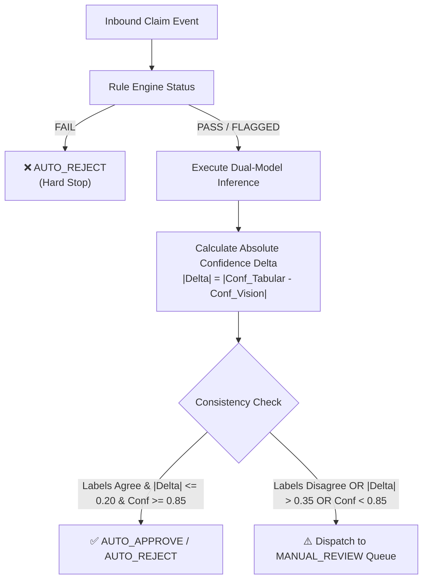

# Chapter 16: Confidence Comparison, Disagreement Detection & Arbitration

---

## 16.1 The Dual-AI Arbitration Paradigm

When deploying artificial intelligence in financial and warranty authorization pipelines, trusting a single model introduces catastrophic failure points (e.g. data poisoning, adversarial noise, edge-case hallucinations).

The **AssureX Arbitration Subsystem** compares the outputs of two fundamentally disparate architectures:
1. $\mathbf{M}_{\text{tabular}}$: Random Forest operating on tabular database features.
2. $\mathbf{M}_{\text{vision}}$: MobileNetV2 operating on spatial Claim Summary Cards.



---

## 16.2 Confidence Delta & Consistency Tiers

The confidence divergence metric is defined as:
$$|\Delta_{\text{conf}}| = |P_{\text{tabular}}(y = \hat{y}_{\text{tabular}}) - P_{\text{vision}}(y = \hat{y}_{\text{vision}})|$$

```
+-------------------------------------------------------------------------------+
|  STRONG_MATCH (Delta <= 0.10)   --> High Consensus (Automated Settlement)     |
|  ACCEPTABLE   (Delta <= 0.20)   --> Moderate Variance (Automated Settlement)  |
|  WEAK_MATCH   (Delta <= 0.35)   --> Borderline Divergence (Audit Recommended) |
|  DISAGREEMENT (Delta > 0.35)    --> Severe Discrepancy (FORCED MANUAL REVIEW) |
+-------------------------------------------------------------------------------+
```

---

## 16.3 Arbitration Decision Matrix

| Rule Engine Result | Tabular Prediction ($\hat{y}_T$) | Vision Prediction ($\hat{y}_V$) | $|\Delta_{\text{conf}}|$ | System Action | Final Decision |
|---|---|---|---|---|---|
| **FAIL** | *Any* | *Any* | *Any* | Hard policy rejection | **`AUTO_REJECT`** |
| **PASS** | `Valid Claim` ($\ge 0.85$) | `Valid Claim` ($\ge 0.80$) | $\le 0.20$ | Automated payout approval | **`AUTO_APPROVE`** |
| **PASS** | `Invalid Claim` ($\ge 0.85$) | `Invalid Claim` ($\ge 0.80$) | $\le 0.20$ | Automated rejection notice | **`AUTO_REJECT`** |
| **PASS** | `Valid Claim` | `Manual Review` / `Invalid` | $> 0.35$ | Disagreement escalation | **`MANUAL_REVIEW`** |
| **FLAGGED_REVIEW** | *Any* | *Any* | *Any* | Discretionary review | **`MANUAL_REVIEW`** |
| **PASS** | Any class ($< 0.85$) | *Any* | *Any* | Low confidence fallback | **`MANUAL_REVIEW`** |

This strict arbitration policy guarantees that no ambiguous or divergent claim ever gets automatically approved.