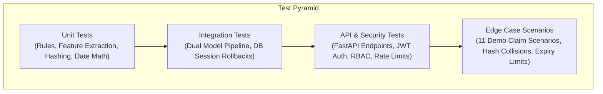

# Chapter 17: Quality Assurance & Testing Strategy

---

## 17.1 Comprehensive QA Architecture

Quality assurance for the AssureX Claim Engine spans unit tests, integration tests, boundary condition assertions, regression suites, and end-to-end API verification using **Pytest**.

---

## 17.2 Specialized Test Suites

### 1. Deterministic Rule Engine Test Suite (`tests/test_rule_engine.py`)
- Asserts that all 6 hard-stop policy exclusion rules trigger properly on prohibited inputs.
- Validates that 15-day grace period boundaries transition smoothly to `FLAGGED_REVIEW`.
- Checks duplicate hash matching against database entries.

### 2. Machine Learning Pipeline Test Suite (`tests/test_python_model.py` & `test_model_comparison.py`)
- Verifies model candidate selection ($\ge 3$ algorithms benchmarked).
- Evaluates test accuracy $\ge 85.0\%$ threshold assertion.
- Asserts inference latency $\le 50\text{ ms}$ on batch inputs.

### 3. Boundary & Negative Case Testing (`tests/test_boundary_cases.py` & `test_negative_cases.py`)
- **Temporal Contradictions:** Claim filed before purchase date.
- **Serial Mismatches:** OCR extracted serial differing by 1 character.
- **Reporting Deadlines:** Claims submitted on Day 29 vs Day 31 post-defect.
- **Corrupted Payloads:** Malformed JSON, missing nested fields, invalid image files.

---

## 17.3 Automated CI/CD Pipeline

The GitHub Actions continuous integration workflow (`.github/workflows/ci.yml`) executes on every commit and pull request:
1. Environment provisioning (Python 3.11 & 3.12).
2. Dependency installation & linting (`flake8`, `black --check`, `mypy`).
3. Automated test execution (`pytest --cov=src --cov-report=xml`).
4. Metric regression check (asserts accuracy on validation split does not drop below 90%).