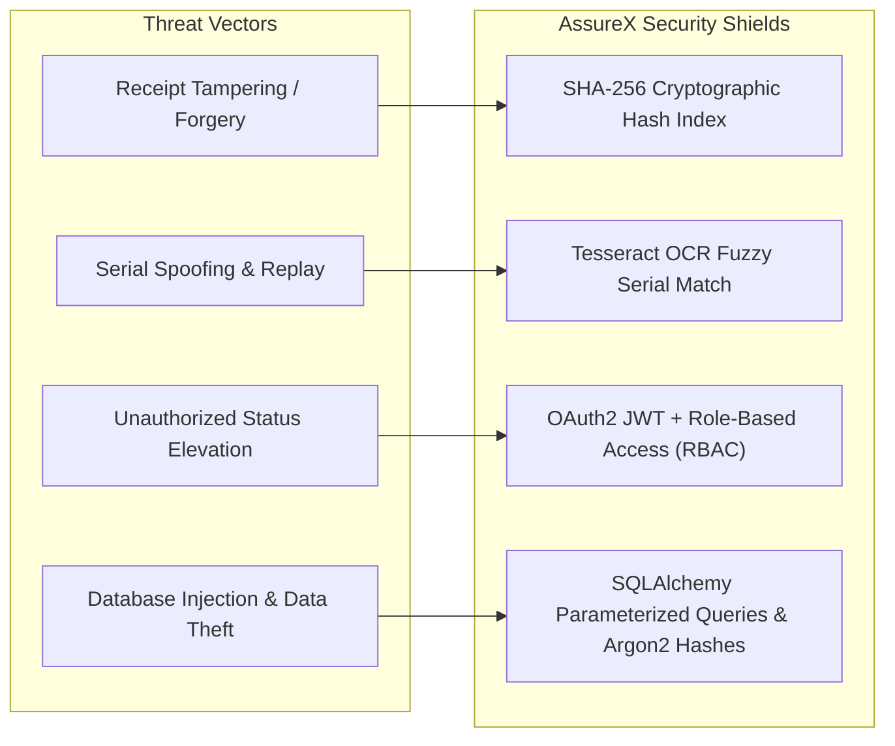

# Chapter 18: Security, Data Privacy & Regulatory Compliance

---

## 18.1 Threat Modeling & Mitigation Architecture

Warranty claims infrastructure interfaces directly with financial payouts and customer sensitive data, exposing it to diverse attack vectors:

---

## 18.2 Role-Based Access Control (RBAC) Specification

The system defines 4 distinct security tiers in `config/roles.yaml`:

| Role Tier | Accessible Endpoints | Permissions |
|---|---|---|
| **`claimant`** | `POST /api/v1/claims/submit`, `GET /api/v1/claims/status/{id}` | Submit claim, upload documents, view own claim status |
| **`adjuster`** | `GET /api/v1/dashboard/queue`, `POST /api/v1/reviews/adjudicate` | Inspect flagged claims, view model predictions, approve/reject manual cases |
| **`fraud_investigator`** | `GET /api/v1/analytics/*`, `GET /api/v1/audit/*` | Global fraud clustering, duplicate hash search, audit log export |
| **`admin`** | All API routes + `/api/v1/admin/settings`, `/api/v1/admin/retrain` | System threshold configuration, user management, model deployment |

---

## 18.3 Data Privacy & Compliance (GDPR & SOC 2)

1. **PII Masking & Storage Isolation:** Customer phone numbers, emails, and street addresses are encrypted at rest using AES-256 and masked in adjuster review consoles.
2. **Immutable Audit Trails:** Every automated decision, model score, and manual override is recorded in the `audit_logs` table with timestamp, user ID, client IP address, and cryptographic state hash.
3. **Right-to-Erasure (GDPR Art. 17):** Personal claim records can be purged while maintaining anonymized statistical aggregates for machine learning benchmarks.