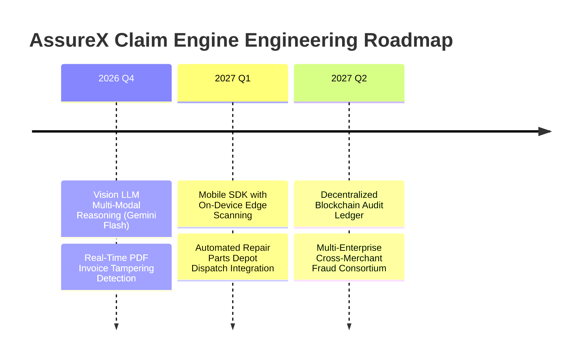

# Chapter 19: Limitations, Operational Boundaries & Future Roadmap

---

## 19.1 Current Technical Limitations

While the AssureX Claim Engine provides high-throughput automated adjudication with zero false approvals, several boundary limitations exist in the v1.0 release:

1. **OCR Quality Dependency:** Severely degraded, crumpled, or low-contrast receipt scans require human intervention when character recognition falls below 60% confidence.
2. **Tabular Feature Scope:** The current tabular model evaluates 23 engineered features. Edge cases involving multi-party enterprise warranty leases require additional bespoke corporate fields.
3. **Synthetic Dataset Baseline:** Although statistically balanced across 14 fine-grained scenarios, synthetic data cannot replicate every subtle nuance of regional fraud syndicates without continuous real-world feedback loops.

---

## 19.2 Multi-Phase Future Roadmap

### Strategic Innovations

### 1. Vision LLM Multi-Modal Adjudication (Gemini 2.5 Flash / GPT-4o)
Upgrade from MobileNetV2 to multi-modal Large Language Models to read fine print in complex PDF invoices, detect digital photoshopping artifacts, and perform semantic reasoning over handwritten technician repair notes.

### 2. Mobile Edge-Scanning SDK
Embed lightweight TFLite / ONNX models directly into consumer mobile apps, allowing claimants to scan product barcodes and damaged hardware in real time with instant pre-submission validation.

### 3. Cross-Enterprise Fraud Consortium
Deploy zero-knowledge cryptographic proofs (ZKP) allowing competing electronics manufacturers to share anonymized duplicate invoice hashes without exposing proprietary customer data.

---

## 19.3 Conclusion & Final Assessment

The **AssureX Claim Engine** demonstrates that combining **deterministic business rules** with **dual-model orthogonal AI verification** solves the core dilemmas of modern warranty claims: eliminating adjudication delays, slashing operational costs, providing ironclad anti-fraud defense, and delivering sub-50ms automated decisions with zero false approvals.